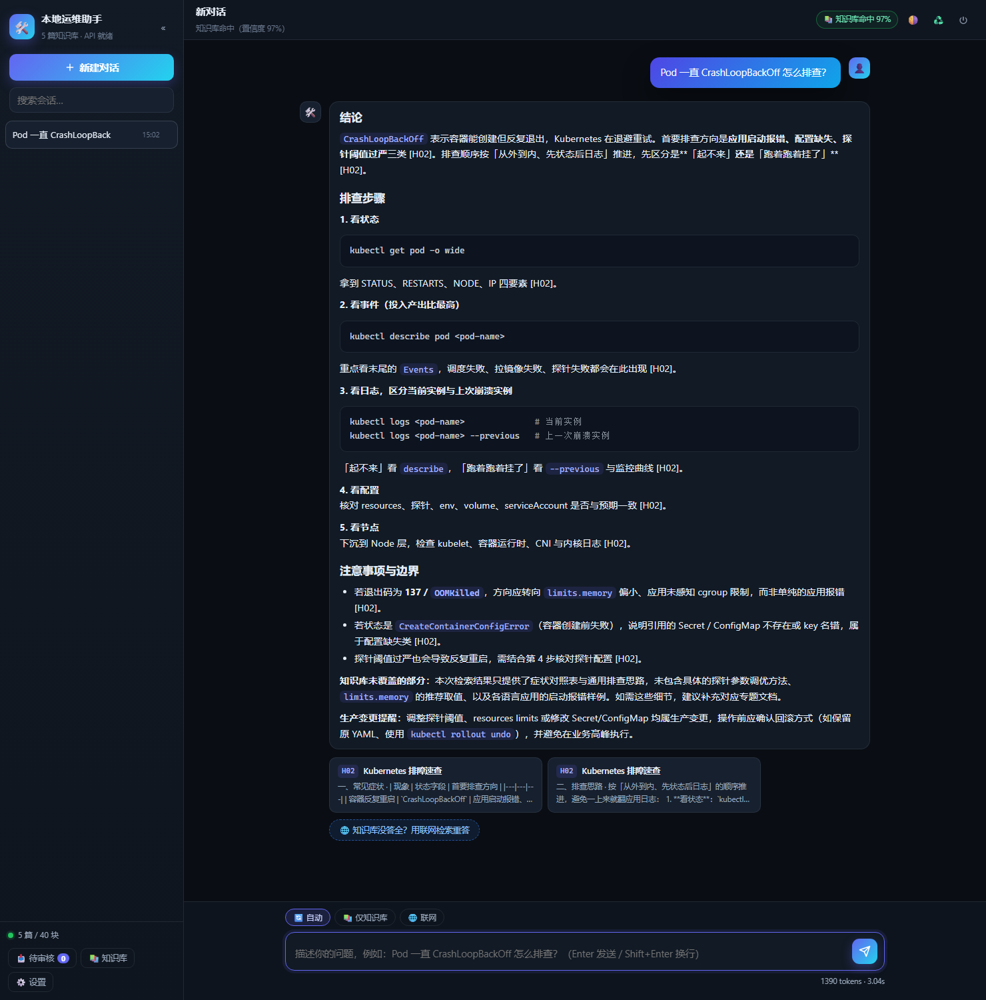

# ops-kb-assistant

本地知识库问答服务。把自己整理的技术笔记接上大模型 API，做成一个能直接提问的助手。

先查自己的笔记，笔记里没有的才去联网搜。纯 Python 标准库实现，不需要向量数据库，也不需要 GPU。



结构上就是一个跑在本机的 agent 循环：手里只有两个工具（查笔记、联网搜），模型自己决定先调哪个、
够不够用、要不要再补一次，最后把答案连来源一起给你。

---

## 背景

技术笔记攒到一定量之后就很难用了。全文搜索只能匹配字面词，问「pod 一直重启怎么办」，
搜不到那篇标题写着 `CrashLoopBackOff` 的笔记 —— 名字对不上，就找不到。

这个项目在笔记目录上做了一层检索：先用关键词在本地笔记里找，找到就直接用笔记内容回答，
并在答案里标出来源；找不到再去联网搜，搜到的东西**不直接入库**，而是落到待审核区，
人工看过之后再决定要不要收进正式笔记。

## 特性

- 本地笔记优先，回答里标注来源（如 `[D02]`），点开可以看原文
- 命中的把握不足时才联网，默认用 Bing，失败自动降级到 Baidu
- 联网结果先写进 `kb/_inbox/`，人工确认后才进正式目录，不会覆盖已有笔记
- 会话记录存在 SQLite 里，刷新页面、重启服务都不会丢
- 零第三方依赖，装好 Python 直接跑
- 改了 `.env` 会自动热重载，不用重启服务（换 API Key 尤其省事）
- 启动前先探测端口，不会起出第二个实例跟旧的抢同一个端口
- 前端资源（marked、highlight.js）都在仓库里，页面运行时不请求外网
- 默认只监听 `127.0.0.1`

## 快速开始

### 环境要求

- Python **3.10+**（用到 `X | None` 这类新语法，3.9 及以下跑不了）
- 一个兼容 OpenAI 协议的 LLM API Key

### 安装

```bash
git clone https://github.com/xcl520-GIT/ops-kb-assistant.git
cd ops-kb-assistant
copy .env.example .env        # Windows
# cp .env.example .env        # macOS / Linux
```

没有 pip 依赖需要安装。

### 配置

编辑 `.env`，至少填一个 API Key：

```ini
DEEPSEEK_API_KEY=sk-你的key
```

`KB_DIR` 默认指向仓库里的 `kb/`，里面放了 5 篇示例笔记，直接启动就能问。
换成自己的笔记目录时，可以写相对路径（相对项目根目录）或绝对路径。

### 启动

```bash
python app.py
```

然后打开 <http://127.0.0.1:8765>。

Windows 上还可以直接双击 `start.bat`：它会检查端口、后台启动服务，然后打开浏览器。
不需要开机自启，用的时候点一下就行。停止服务用 `stop.bat`，或者页面右上角的 ⏻。

## 使用

界面左上角可以切换三种模式：

| 模式 | 行为 |
|---|---|
| 自动 | 先查笔记，把握不足再联网。日常用这个 |
| 仅知识库 | 只依据本地笔记回答，用来检查笔记覆盖得够不够 |
| 联网 | 直接联网搜，用来问时效性的问题 |

每条回答下面会列出用到的来源。`[D02]` 这种是本地笔记，点开看原文；`1` `2` 这种是网页链接。

如果回答里出现「知识库未覆盖」，下面会多一个按钮，点一下就用同一个问题走联网重答。

侧边栏的「待审核」里能看到联网检索攒下来的草稿。核对内容之后，选目标分类、填 ID
（可以点「自动」按已有编号顺延），点「采纳入库」就会移进正式目录。如果勾了登记总索引，
程序会先备份索引文件再改。

## 出问题了先跑这个

Windows 上直接双击 `doctor.bat`。它会依次看：端口有没有在监听、有没有出现多条监听
记录（双实例）、`/api/health` 通不通、知识库索引了多少篇，最后**直连服务商实测 API Key**
（先探活 `/models`，再发一条最小对话）。

想单独跑也行：

```bash
python tools\health.py          # 服务状态 + 知识库索引
python tools\check_api_key.py   # 只测 Key，会打印可用模型列表
```

### 换了 API Key

两种改法，都不用重启：

| 方式 | 生效时机 |
|---|---|
| 界面右上角 ⚙️ 设置 → 粘贴新 Key → 保存 | 立刻 |
| 直接编辑 `.env` 里的 `DEEPSEEK_API_KEY` | 保存后下一个请求自动带上 |

改完想确认，跑 `python tools\check_api_key.py`，或者在设置里点「测试」。

> 早期的版本配置只在进程启动时读一次，改完文件不重启就还是旧值——"我明明换了 Key 却还是
> 报 401"多半是这么来的。现在配置文件被外部改动会自动重载，`logs\app.log` 里能看到
> 「检测到 .env 变更，配置已自动重载」。

### 端口被占用 / 好像有两个实例

Windows 上 `SO_REUSEADDR` 允许两个进程绑同一个端口。真出现这种情况，请求会被随机分给
其中任意一个——症状就是"我明明改了配置，却像没生效"。

现在的处理方式：

- 服务启动前先探测端口：已经有本助手在跑就直接中止并提示，不会偷偷起第二个
- `stop.bat` 先杀监听进程，再清扫残留的 `app.py` 进程
- `doctor.bat` 里看到多条监听记录就是有双实例：先 `stop.bat`，再 `start.bat`

## 配置项

| 配置 | 默认值 | 说明 |
|---|---|---|
| `DEEPSEEK_API_KEY` | — | API Key |
| `DEEPSEEK_BASE_URL` | `https://api.deepseek.com` | 改成别的兼容服务地址也能用 |
| `MODEL` | `deepseek-chat` | 模型名 |
| `TEMPERATURE` | `0.3` | 运维问答建议 0.2~0.4 |
| `MAX_TOKENS` | `2048` | 单次回答上限 |
| `HISTORY_TURNS` | `6` | 带进模型的历史对话轮数 |
| `KB_DIR` | `./kb` | 笔记目录 |
| `TOP_K` | `5` | 每次召回的片段数 |
| `KB_SCORE_THRESHOLD` | `0.5` | 命中阈值，见下 |
| `MAX_CONTEXT_CHARS` | `9000` | 送进模型的上下文上限 |
| `WEB_SEARCH_ENABLED` | `true` | 联网检索开关 |
| `WEB_ENGINES` | `bing,baidu` | 引擎顺序，失败自动降级 |
| `WEB_MAX_PAGES` | `3` | 每次抓几个网页正文 |
| `AUTO_INGEST` | `inbox` | `off` 不回写 / `inbox` 写待审核区 / `auto` 直接入库 |
| `PORT` | `8765` | 服务端口 |

### 关于 `KB_SCORE_THRESHOLD`

这是最需要按自己的语料调的一个值。

- 笔记里明明有，却总是跑去联网 → 调低（比如 0.45）
- 笔记里没有，模型硬答 → 调高（比如 0.6）

调的时候用 `GET /api/kb/search?q=你的问题` 看实际打分，返回里会带上
`vocab_cov` / `hit_cov` / `head_cov` 三个分量，比盲调靠谱。

## 工作原理

```
问题
 └─ 本地检索（SQLite FTS5 + 中文 bigram + 字段加权）
      ├─ 置信度 ≥ 阈值 → 用笔记内容回答，标注 [ID]
      └─ 置信度 <  阈值 → 联网搜 → 抓正文 → 用网络内容回答，标注 [1][2]
                                        └─ 写一份草稿到 kb/_inbox/
```

几个实现上的选择：

**用 SQLite FTS5 做检索。** Python 自带 `sqlite3` 模块就带 FTS5，C 实现的倒排索引，
不用装任何东西。在约 120 篇、5 MB 的笔记集上实测：建索引 1.4 秒，单次检索 10 毫秒左右。

**中文按二元组（bigram）切。** 英文分词、中文切二字组，存进 FTS5 的单独一列，
查询时同样处理。标题、别名、小节标题、正文各占一列，检索时给不同权重
（标题 3.0 / 别名 2.5 / 小节标题 1.8 / 正文 1.0）。

**排序要单独处理。** 二元组切分会切出「启怎」「么排」这种跨词的碎片，它们罕见但没意义，
按 IDF 加权反而会盖过 `k8s`、`pod` 这类真正重要的词。所以排序时对 IDF 做了封顶，
并且给英文技术名词（`k8s`、`terraform`、`exporter`）额外加权，再叠加标题/别名的匹配加成。

**置信度由三个分量算出来。** 词汇覆盖率（问题里的词有多少被笔记集认识，用来判断话题是不是
压根不在笔记范围内）、命中覆盖率（这些词有多少真的落在召回内容里）、头部覆盖率
（最佳命中文档的标题/别名/标签覆盖了多少）。三者按 0.45 / 0.40 / 0.15 加权。

## 知识库文档格式

每篇笔记是一个 Markdown 文件，文件头是 YAML front-matter：

```markdown
---
id: H02
title: Kubernetes 排障速查
volume: H-云原生
tags: [kubernetes, 排障, pod]
aliases: [k8s排障, pod一直重启, CrashLoopBackOff, 节点NotReady]
level: L2
prerequisites: []
related: [D02]
status: 生效
updated: 2026-01-01
---

# Kubernetes 排障速查

## 一、常见症状
...
```

其中 `aliases` 对检索效果影响最大，值得多写几条：把同一个意思的各种说法都放进去，
尤其是**报错原文**和**口语化的问法**。用户问「pod 老是重启」，靠的就是别名里有
`pod一直重启` 才召得回来。

`volume` 用来给文档分组，界面上按它归类展示。`id` 在回答里作为引用标识。

## 目录结构

```
ops-kb-assistant/
├── app.py                  HTTP 服务、路由、SSE 流式输出
├── core/
│   ├── config.py           配置加载
│   ├── kb.py               索引构建与检索
│   ├── llm.py              大模型接口调用
│   ├── websearch.py        联网检索与网页正文提取
│   ├── store.py            会话存储
│   ├── ingest.py           笔记回写与采纳
│   └── prompts.py          系统提示词
├── static/                 前端页面（含本地化的第三方库）
├── kb/                     知识库示例
├── docs/                   截图
├── tools/                  自测、体检、截图等小工具
├── start.bat / stop.bat    Windows 启动、停止
├── doctor.bat              Windows 一键体检
└── .env.example            配置模板
```

## 自测

```bash
python tools/selftest.py all       # 建索引 + 检索命中率 + 接口连通性 + 联网
```

`tools/selftest.py` 里的用例是照示例库写的。换成自己的笔记之后，
把 `CASES` 里的问题和期望文档 ID 改成自己库里的内容，就能用来校准命中阈值。

## 常见问题

**页面打开是白的 / 显示「服务未连接」**
服务没起来。用 `python app.py` 直接跑一次，看终端里的报错。

**回答报 401**
API Key 不对，或者已经失效。

**回答报 402**
账户余额不够。

**从来不联网**
先确认设置里联网开关是开着的，再检查是不是 `KB_SCORE_THRESHOLD` 太低、
所有问题都被判成命中了。

**改了笔记但检索不到**
不用手动重建，服务会在下次检索时检测文件修改时间并自动重建索引。
如果确认没生效，点页面右上角的 ♻️ 强制重建。

**页面改了代码没变化**
`static/index.html` 里给 `app.css` 和 `app.js` 带了版本号，改完记得把 `?v=` 后面的数字加一。

## 已知限制

- 检索是关键词级的，不理解语义。问得太抽象（比如「怎么让系统更快」）可能命中不准，
  这种情况靠补 `aliases` 解决，比换模型有效。
- 联网只验证过 Bing 和 Baidu。Google、DuckDuckGo 在部分网络环境下连不上，所以没做成默认。
- 单用户本地模式，没有登录和权限控制。要给别人用的话需要自己加认证。
- 搜索结果质量取决于搜索引擎返回的页面，程序只做了基础的正文提取。

## License

MIT
